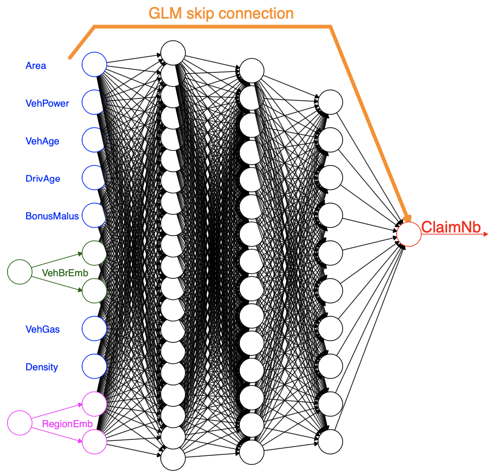
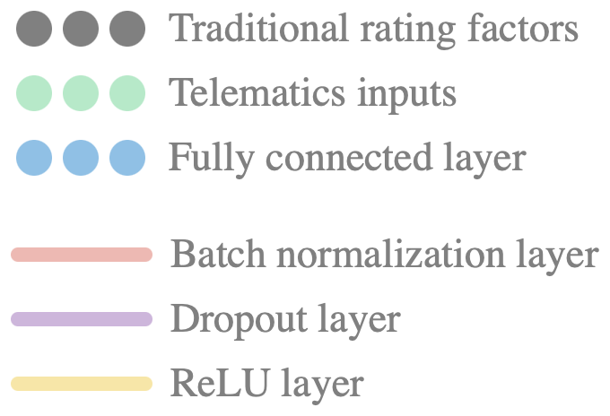

class: title-slide
background-image: url(images/logo_chaire.jpg), url(images/background.jpg)
background-size: 30%, cover
background-position: 98% 98%, center


```{r xaringanExtra-scribble, echo = F}
xaringanExtra::use_scribble()
```

.titre-page-titre[Telematics Combined Actuarial Neural Networks for Claim Count Data]
<br />
.sous-titre-page-titre[Co-operators Show and Share]
<br />
<br />
***
<br />
<br />
.sous-sous-titre-page-titre[.mon-style-bleu[par] Francis Duval (Jean-Philippe Boucher, Mathieu Pigeon) <br> .mon-style-bleu[à] l'Université du Québec à Montréal <br> .mon-style-bleu[le] 17 mai 2023]

???

- Francis Duval, PhD candidate member of the CARA Chair.
- Research project that is part of my thesis.
- Many thanks to Marc Morin from the BI team for helping me with the coding of the neural networks in Torch and for helping me developing my intuition in deep learning.

---

# Introduction

.left-column[
```{r echo = F, out.width = "60%", fig.align = "center"}
knitr::include_graphics("images/tele_icon.png")
```

```{r echo = F, out.width = "65%", fig.align = "center"}

```

```{r echo = F, out.width = "60%", fig.align = "center"}
knitr::include_graphics("images/nn_icon.png")
```
]

.right-column[
<br>
<br>
<br>
.ecriture-grise[For several years now, insurers have been using telematics information in their pricing models.]
<br>
<br>
<br>
.ecriture-grise[Most of the time, human brainpower is used to extract features from raw data that are thought to be correlated with claiming risk.]
<br>
<br>
<br>
.ecriture-grise[What if we automated this feature engineering process with a neural network?]
]

???

- Insurers have been leveraging telematics data in their pricing models for several years now.
- Using telematics data in pricing model has many benefits:
  - More precise pure premium
  - Incentive for safer and less frequent driving (less accidents, congestion and pollution)
  - Substitute to sensible rating factors
  - Etc.
- Insurers will most of the time take the raw telematics data and try to extract features from it that they think are correlated with the claiming risk:
  - harsh acceleration/braking
  - % night driving
  - % driving in different speed buckets
  - Etc.
- Good ad hoc approach, but might be suboptimal
- Since we know that deep neural networks are good at learning useful features from raw data, why not feed the telematics data to a multilayer perceptron and let it extract the features itself?

---

# Introduction
<div class="neg-break"></div>
## Combined Actuarial Neural Network (CANN) approach
<div class="neg-break"></div>
.pull-left[
```{r echo = F, out.width = "90%", fig.align = "center"}

```

.center[Figure taken from [this paper](https://papers.ssrn.com/sol3/Delivery.cfm/SSRN_ID3320525_code769240.pdf?abstractid=3320525)
]].
</br>
</br>
</br>
.ecriture-grise[Consists of a .bleu-gras[classical parametric model] (often a GLM) to which a .bleu-gras[neural network] has been attached.]

.ecriture-grise[The goal of the neural network part is to .bleu-gras[capture] any .bleu-gras[signal] that might have been missed by the GLM.]

.ecriture-grise[Parameters for the GLM part are typically initialized at .bleu-gras[maximum likelihood], while those of the neural network part are initialized to .bleu-gras[zero].]

???

- Here is the generic neural network (NN) architecture we use to model the number of claims.
- Developed by Mario V. Wüthrich And Michael Merz, it is called the "Combined Actuarial Neural Network", or CANN for short.
- It's a NN that consists of 2 parts: the GLM part and the network part.
- The GLM part acts like a regular GLM, while the network attached to it aims at capturing the signal that have been missed by the GLM.
- Indeed, a GLM is not able to capture interactions between predictors and can only approximate linear functions of predictors. The network part helps to improve performance.
- One will usually initialize the parameters of the GLM part at maximum likelihood, while the parameters of the network part will be initialized at zero.
- That way, the whole NN already gives decent predictions at initialization. When the training starts, the network part is in fact trained on the residuals of the GLM, and we can thus see the procedure as a NN boosting of the GLM.
- This CANN architecture is good because:
  - The GLM part allows to have more interpretability
  - The CANN is initialized at decent GLM predictions, which makes the training faster.
  - It is very flexible. In this example, both parts are fed with the same inputs. However, one could include other types of inputs in the network part. In general, we know that NN are good at dealing with unstructured data such as telematics data and text data.
  - The fact that the network part is attached to the GLM part ensures that the network does not catch the signal that has already been caught by the GLM.
- It would even be possible, with this architecture, to extract features from the hidden layers and then use them in a regular GLM.
- In brief, this architecture could be useful in any supervised learning problem, particularly when unstructured data is available.

---

background-image: url(images/perceptron.png)
background-size: 75%
background-position: 100% 70%

# GLM as a neural network

.ecriture-grise[Equivalence table]
.left-column[
| Perceptron | GLM |
|--------|-----------|
| Bias $w_0$ | $\beta_0$ |
| Weights $w_1, \dots, w_m$ | $\beta_1, \dots, \beta_p$ |
| Activation function $g$ | Inverse link function $g^{-1}$ |
]

???

- You may wonder how it is possible to embed a GLM with a neural network.
- In fact, this is easy because the prediction function of a GLM is the same as a perceptron, which is the building block of neural networks.
- So in both in a GLM and a perceptron, the inputs are each multiplied by a weight. the products are then added together before being passed to an activation function. Here the activation function is the sigmoid, so we have a Bernoulli GLM, or logistic regression.
- Since we want to model claim count, our activation function will be the sofplus since we want positive outputs.

---

# Data

## Traditional risk factors 
<div style="margin-top: -70px; margin-left: -110px; margin-bottom: 20px;" class="layer">
  <div class="neuron gris"></div>
  <div class="neuron gris"></div>
  <div class="neuron gris"></div>
</div>

<!-- <div style="margin-top: -60px; margin-left: 450px; margin-bottom: 40px;" class="neuron gris"></div> -->


| Name                | Description                                              | Type        |
|---------------------|----------------------------------------------------------|-------------|
| `annual_distance`   | Annual distance declared by the insured                  | Numeric     |
| `commute_distance`  | Distance to the place of work declared by the insured    | Numeric     |
| `conv_count_3_yrs_minor` | Number of minor contraventions in the last 3 years  | Numeric     |
| `gender`            | Gender of the insured                                    | Categorical |
| `marital_status`    | Marital status of the insured                            | Categorical |
| `pmt_plan`          | Payment plan chosen by the insured                       | Categorical |
| `veh_age`           | Vehicle age                                              | Numeric     |
| `veh_use`           | Use of the vehicle                                       | Categorical |
| `years_claim_free`  | Number of years since last claim                         | Numeric     |
| `years_licensed`    | Number of years since obtaining driver's license         | Numeric     |
| `distance`          | Real distance driven                                     | Numeric     |

???

- Here are the traditional risk factors that we use. Note that we include the real distance driven since it is a telematics feature known to have a lot of predictive power.
- In the computational graphs that I will show later, these rating factors are represented by grey circles.

---

# Data

## Extract from the telematics dataset

| Contract ID | Trip ID | Departure datetime | Arrival datetime | Distance | Maximum speed |
|:-----------:|:------:|:-----------------:|:----------------:|:--------:|:-------------:|
| A | 1 | 2017-05-02 19:04:15 | 2017-05-02 19:24:24 | 25.0 | 104 |
| A | 2 | 2017-05-02 21:31:29 | 2017-05-02 21:31:29 | 6.4 | 66 |
| $\vdots$ | $\vdots$ | $\vdots$ | $\vdots$ | $\vdots$ | $\vdots$ |
| A | 2320 | 2018-04-30 21:17:22 | 2018-04-30 21:18:44 | 0.2 | 27 |
| B | 1 | 2017-03-26 11:46:07 | 2017-03-26 11:53:29 | 1.5 | 76 |
| B | 2 | 2017-03-26 15:18:23 | 2017-03-26 15:51:46 | 35.1 | 119 |
| $\vdots$ | $\vdots$ | $\vdots$ | $\vdots$ | $\vdots$ | $\vdots$ |
| B | 1485 | 2018-03-23 20:07:08 | 2018-03-23 20:20:30 | 10.1 | 92 |
| C | 1 | 2017-11-20 08:14:34 | 2017-11-20 08:40:21 | 9.7 | 78 |
| $\vdots$ | $\vdots$ | $\vdots$ | $\vdots$ | $\vdots$ | $\vdots$ |

???

- This is the telematics dataset I have a my disposal. Each row is a trip, which is depicted by 4 attributes: the departure and arrival datetime, the distance driven and the maximum speed reached.
- For instance, contract A has 2320 trips.
- Even though neural networks are known to perform well on raw data, this dataset still needs a minimal amount of preprocessing in order to make it more informative to the NN.

---

# Data

<div style="margin-top: -30px;"></div>

## Telematics inputs

<div style="margin-top: -70px; margin-left: -370px; margin-bottom: 20px;" class="layer">
  <div class="neuron vert"></div>
  <div class="neuron vert"></div>
  <div class="neuron vert"></div>
</div>

.ecriture-grise[We want the neural network to learn features from the telematics dataset, but we still need a minimal preprocesssing.]

<div style="margin-top: -5px;"></div>
.ecriture-grise[We thus define the following vectors:]

.bloc.bleu[
$\boldsymbol{h} = (h_1, h_2, \dots, h_{24})$ where $h_i$ is the fraction of driving in the $i^\text{th}$ hour of the day.

$\boldsymbol{p} = (p_1, p_2, \dots, p_7)$ where $p_i$ is the fraction of driving in the $i^\text{th}$ day of the week.

$\boldsymbol{vmo} = (vmo_1, vmo_2, \dots, vmo_{14})$ where $vmo_i$ is the fraction of trips in the $i^\text{th}$ interval of average speed.

$\boldsymbol{vma} = (vma_1, vma_2, \dots, vma_{16})$ where $vma_i$ is the fraction of trips in the $i^\text{th}$ interval of maximum speed.
]

.ecriture-grise[We then concatenate these 4 vectors into a big input vector of dimension 24 + 7 + 14 + 16 = 61, which will be given as input to the MLP part of the CANN model:]

$\textbf{telematics_input_vec} = (\boldsymbol{h}, \boldsymbol{p}, \boldsymbol{vmo}, \boldsymbol{vma})$

???

- From this telematics dataset, we therefore create 4 telematics vectors.
- The first one, h, is of dimension 24 (for the 24 hours of the day), and each elements is the fraction of driving in the correponding hour of the day. For instance, $h_1$ is the fraction of driving for a given contract made between midnight and 1:00.
- The second one is similar, but instead records the fraction of driving in each day of the week.
- vmo records the fraction of trips made in different buckets of average speed. I made 10 kilometers per hour buckets, so for instance, vmo_1 is the fraction of trips made at an average speed between 0 and 10 kph. 
- vma is the same, but for maximum speed. 
- We then concatenate these 4 vectors into 1 big telematics vector, which summarises the driving habits of a given contract.
- These telematics inputs are represented by green circles.

---
$$\newcommand{\Xcal}{\mathcal{X}}$$
# Poisson regression

<div style="margin-top: -60px;"></div>
**Assumptions:**
- Given its predictors $\boldsymbol{x}_i$, the PMF of $Y_i$, the number of claims for contract $i$, is given by:
\begin{align}
P(Y_i = y_i|\boldsymbol{X}_i) = \frac{e^{-\mu(\boldsymbol{x_i})}\mu(\boldsymbol{x_i})^{y_i}}{y_i!}, \quad y_i = 0, 1, \dots,
\end{align}
with
\begin{align}
\mathbb{E}(Y_i) = \text{Var}(Y_i) = \mu(\boldsymbol{x_i})
\end{align}

**Goal:**
- Find a good regression function $\mu: \Xcal \rightarrow \mathbb{R}^+$ mapping the predictors $\boldsymbol{x}$ to the parameter $\mu$.

**How to proceed:**
- Choose a specification for the regression function $\mu(\cdot)$ 
- Minimise the negative log-likelihood over the training set:
\begin{align}
\underset{\mu}{\text{minimize}} \left\{ -\frac{1}{n} \sum_{i \in \mathcal{T}} y_i \ln\left[\mu(\boldsymbol{x_i})\right] - \mu(\boldsymbol{x}_i)\right\}
\end{align}

???

- First specification we consider is Poisson, which means the number of claims is assumed to follow a Poisson distribution.
- The goal is the find a good regression function mapping the predictors x to the mean parameter mu.
- A way to proceed is to first choose a specification for the regression function space: it can be a GLM, a neural network, a random forest, etc.
- Then, we can search the function space and try to minimize the negative log-likelihood. With NN, this minimization procedure is carried on with gradient descent.

---

background-image: url(images/PoissonCANN.png)
background-size: 60%
background-position: 80% 80%

# Poisson CANN

.pull-left[
```{r echo = F, out.width = "60%", fig.align = "left"}

```
<br>
<br>
<br>
<br>
<br>
<br>
<br>
<br>
- The output $\mu$ is compared with the response $y$ to compute the negative log-likelihood.
]

???

- This is the CANN architecture for the Poisson specification.
- The GLM part has only the traditional risk factors as inputs, while the network part, which is a MLP, has both traditional risk factors and the telematics vector as inputs. This allows to consider traditional-telematics interactions.
- Note that the MLP part has in fact 3 hidden layers, and not 2 as shown.
- So the output of the GLM part is added to the output of the MLP part, and then this sum is passed through the softplus function to ensure a positive mu output.
- The loss function used is the Poisson negative log-likelihood.
- I will not go through the details of the MLP part, but you can simply think of it as a complex function approximation machine that complements the GLM.

---

$$\newcommand{\Xcal}{\mathcal{X}}$$
# Negative binomial regression

**Assumptions:**
- Given its predictors $\boldsymbol{x}_i$, the PMF of $Y_i$, the number of claims for contract $i$, is given by:
\begin{align}
P(Y_i = y_i|\boldsymbol{X}_i) = \frac{\Gamma(y_i + \phi)}{y_i! \Gamma(\phi)} \left(\frac{\phi}{\phi + \mu(\boldsymbol{x}_i)}\right)^\phi \left( \frac{\mu(\boldsymbol{x}_i)}{\mu(\boldsymbol{x}_i) + \phi}\right)^{y_i}, \quad y_i = 0, 1, \dots,
\end{align}
with
\begin{align}
\mathbb{E}(Y_i) = \mu(\boldsymbol{x}_i) \quad \text{and} \quad \text{Var}(Y_i) = \mu(\boldsymbol{x}_i) + \frac{\mu(\boldsymbol{x}_i)^2}{\phi}
\end{align}

**How to proceed**:

- We seek for a good regression function $\mu: \Xcal \rightarrow \mathbb{R}^+$ mapping the predictors $\boldsymbol{x}$ to the parameter $\mu$ and a good estimate of $\phi$.
- Again, we proceed by minimising the negative log-likelihood.
- With this specification, we will need a 2-output neural network

???

- The second specification we consider is the negative binomial.
- The number of claim is now assumed to follow a NB distribution, which has a parameter allowing for overdipersion, which is often the case with claim count data.
- Since the distribution has 2 parameters, we will need a NN with 2 outputs.

---

background-image: url(images/NB2CANN.png)
background-size: 60%
background-position: 80% 80%

# Negative binomial CANN

.pull-left[
```{r echo = F, out.width = "60%", fig.align = "left"}

```
<br>
<br>
<br>
<br>
<br>
<br>
<br>
<br>
- The outputs $\mu$ and $\phi$ are compared with the response $y$ to compute the negative log-likelihood.
]

???

- This is the CANN architecture for the NB specification.
- The only thing that changes is the loss function and the addition of an output neuron to accomodate the new parameter phi.
- Note that we did not include heterogeneity in the phi parameter. 

---

# Multivariate Negative Binomial (MVNB) Regression

<!-- .ecriture-grise[Suited for longitudinal count data]  -->

**Assumptions:**

- The claim vector for insured $i$, $(Y_{i1}, \dots, Y_{iT_i})$, follows a MVNB distribution:

\begin{align}
  (Y_{i1}, \dots, Y_{iT_i}) \sim MVNB
\end{align}

<!-- \begin{align} -->
<!-- P(Y_{i1} = y_{i1}, \dots, Y_{i,T_i} = y_{i,T_i}) = \left(\prod_{t=1}^{T_i} \frac{\mu(\boldsymbol{x}_{it})^{y_{it}}}{y_{it}!}\right) \frac{\Gamma(y_{i\bullet} + \nu)}{\Gamma(\nu)} \left(\frac{\nu}{\sum_{t=1}^{T_i} \mu(\boldsymbol{x}_{it}) + \nu}\right)^\nu \left(\sum_{t=1}^{T_i} \mu(\boldsymbol{x}_{it}) + \nu\right)^{-y_{i\bullet}}, -->
<!-- \end{align} -->
<!-- where $y_{i\bullet} = \sum_{t=1}^{T_i}y_{it}$. -->

- Hard to train a neural network with a multivariate distribution, but fortunately, we can show that
\begin{align}
P(Y_{i1} = y_{i1}|\boldsymbol{X}_{i1}) = \frac{\Gamma(y_{i1} + \phi)}{y_{i1}! \Gamma(\phi)} \left(\frac{\phi}{\phi + \mu(\boldsymbol{x}_{i1})}\right)^\phi \left( \frac{\mu(\boldsymbol{x}_{i1})}{\mu(\boldsymbol{x}_{i1}) + \phi}\right)^{y_{i1}}
\end{align}
and that
\begin{align}
P(Y_{it} = y_{it}|\boldsymbol{Y}_{i, t-1}, \boldsymbol{X}_{i1}, \dots, \boldsymbol{X}_{i, t-1}) = \frac{\Gamma(y_{it} + \alpha)}{y_{it}! \Gamma(\alpha)} \left(\frac{\gamma}{\gamma + \mu(\boldsymbol{x}_{it})}\right)^\alpha \left( \frac{\mu(\boldsymbol{x}_{it})}{\mu(\boldsymbol{x}_{it}) + \gamma}\right)^{y_{it}},\quad t = 2, 3, \dots, T_i.
\end{align}
where $\alpha = \phi + \sum_{t' = 1}^t y_{it'}$ and $\gamma = \phi + \sum_{t' = 1}^t \mu(\boldsymbol{x}_{it'})$.

.ecriture-grise[In essence, modeling longitudinal claim counts with a MVNB is equivalent to modeling with a NB using past history.]

???

- With the Poisson and NB specifications, we assume that the contracts are independent, which is not true.
- Indeed, each insured is observed over many contracts, and the contracts of insured are not independent.
- It is therefore better to have a longitudinal model, and one of the most popular specifications for this is the MVNB.
- So the assumption is that the claim vector for an insured follows a MVNB distribution.
- It is not straightforward to train a NN with a multivariate specification, but fortunately, we can break that down to a univariate problem.
- Indeed, we can show that with the MVNB specification, the number of claims at time t follows a NB distribution with parameters depending on the insured's history.
- This is really the heart of the project because to my knowledge, there is no such model in the actuarial literature.
- Unfortunately, I did not yet code this model, but I'm about to do it. It is not as straightforward to code in Torch as the 2 other specifications because I need to take care of updating the distribution parameters (which depend on past contracts) at each iteration.

---

# Results

.center[
**Poisson specification**

| Model | Mean Squared error | Logarithmic score | 
|:-------------------------------------|:------:|:-----------------:|
| Naïve model (no heterogeneity) | 0.0674 | 0.2441 |
| GLM (only <div class="hover-container"> traditional risk factors <ul class="hover-list"><li>expo</li><li>annual_distance</li><li>commute_distance</li><li>conv_count_3_yrs_minor</li><li>gender</li><li>marital_status</li><li>pmt_plan</li><li>veh_age</li><li>veh_use</li><li>years_claim_free</li><li>years_licensed</li><li>distance</li></ul></div>) | 1.47 % | 3.21 % |
| GLM (traditional risk factors + <div class="hover-container"> handcrafted telematics features <ul class="hover-list"><li>avg_daily_nb_trips</li><li>med_trip_avg_speed</li><li>med_trip_distance</li><li>med_trip_max_speed</li><li>max_trip_max_speed</li><li>prop_long_trip</li><li>frac_expo_night</li><li>frac_expo_noon</li><li>frac_expo_evening</li><li>frac_expo_peak_morning</li><li>frac_expo_peak_evening</li><li>frac_expo_mon_to_thu</li><li>frac_expo_fri_sat</li></ul></div>) | 1.72 % | 3.64 % |
| CANN | 1.78 % | 3.66 % |

**Negative binomial specification**

| Model | Mean Squared error | Logarithmic score | 
|:-------------------------------------|:------:|:-----------------:|
| Naïve model (no heterogeneity) | 0.0674 | 0.2437 |
| GLM (only traditional risk factors) | 1.47 % | 3.12 % |
| GLM (traditional risk factors + handcrafted telematics features) | 1.72 % | 3.54 % |
| CANN | 1.80 % | 3.57 % |
]

**% = improvement over the naïve model**

???

- Here are the results for both Poisson and NB specifications on the validation set. I also kept a separate test set that I do not use until the very end of the project to estimate the generalization performance as reliably as possible.
- The naive model is a model without any predictor and with parameters estimated by maximum likelihood.
- The benchmark against which the CANN model is compared is a GLM with traditional risk factors and handcrafted telematics features as predictors. Indeed, we want to know if a neural network is better than human judgement to extract features.
- The percentages shown correspond to the improvement over the naive model. As can be seen, our CANN model offers a modest improvement over the benchmark GLM using traditional risk factors and handcrafted telematics features.
- Even though the improvement is small over the benchmark, I still believe it can be a useful model. Indeed, a richer telematics dataset could further improve performance. I also do not have a lot of experience in hyperparameter tuning and I did not use a sophisticated method for this, and other architectures may yield better results. Finally, the claim count framework is known to have a lot of randomness. Indeed, we can see that the shift from a naive model to a GLM with traditional risk feature only improve the performance by about 1.5% for the MSE and 3% for the log-score.

---
class: inverse, middle

# Thank you for your attention!

.taille-25[
- Code for the project:
  - [.blanc[github.com/francisduval/article_3_count]](https://github.com/francisduval/article_3_count)
- Link to the slideshow:
  - [.blanc[telematics-cann.netlify.app]](https://telematics-cann.netlify.app)
]
